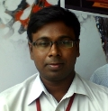
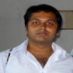
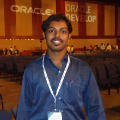
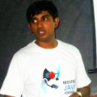
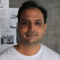



### Will be updated soon.....

### Manigandan
***
*Manigandan* serves IT industry as a Technology Consultant (10 years) and Corporate trainer (5 years). He  has implemented Financial systems for RHFL and IDFC, including CIBIL. Also, he serves various Technology and Business houses - domestic and international on Architecture, technology, training, implementation, quality, maintenance etc. He regularly trains people on Java, JEE, JBOSS, Webservices, Javascript and the related technologies, and has delivered more than 35 corporate trainings.

### Kayalvizhi Jayavel
***
*Kayalvizhi* is working as Assistant Professor in Department of Information Technology,SRM University. Very Passionate about the profession of teaching as it is profession which builds Human. Founder and Faculty Sponsor(2009-2010) of ACM-W chapter at SRM University, which is the first ACM-W chapter in India.Helped in starting similar ACM-W chapters at many other universities like Amrita.

### Shiv Kumar Ganesh
***
*Shiv* is working in Tata Consultancy Services as an System Engineer and deals with enterprise application development using Spring and Java.He is a active user in Java user group chennai. He is contributing to VisageFX and his area of interest lies in RIA and Web Technologies.

### Prasanna Kumar
***
*Prasanna* is a Java developer and working for D&B Transunion as Systems Analyst. He is an active member and regular speaker in JUGChennai.He is a Scala enthusiast and a comitter for ScalaFX, ScalaFX Ensemble and Scalaxia.com. His primary areas of interest are Java, JEE, Scala, SBT, MonogDB, Agile and lean software development practices.

###Arivazhagan
***
*Arivazhagan* has been a Data Analyst since 2011. He is working for First Source Solutions as Data Analyst.He is a active user in Java user group chennai. He is contributing to VisageFX. He is interested in JEE, JavaFX, VisageFX, HTML5 and JavaScript.

### Gautham Kumar
***
*Gautam* is a recent graduate working his favorite Languages are Java and Python 
and is seen mostly playing around with various frameworks. He frequents JUG-Chennai and occasionally presents a few topics

### Rajmahendra Hegde
***
*Raj* is  a Java developer since 2000. He is currently working for Logica as Project Lead/Architect. He is a User Group lead for Java User Group – Chennai. He have contributed to JSR-331, Scalaxia.com.He is comitter for Visage. He primary areas of interest are JEE, JavaFX, JVM Languages (Groovy, Scala & Visage) and NetBeans.

